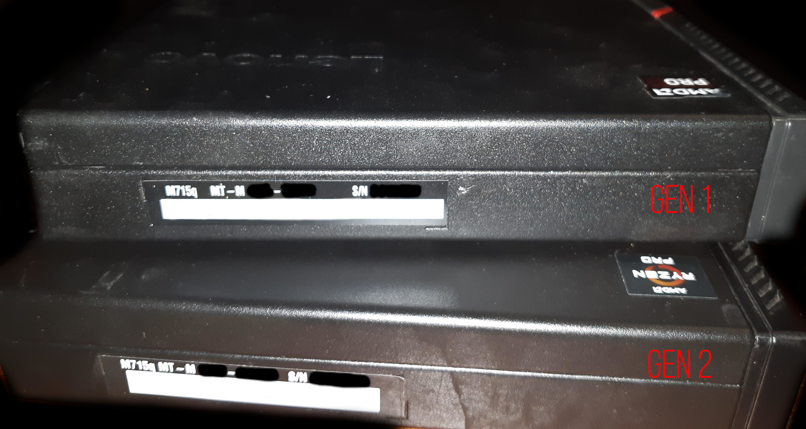
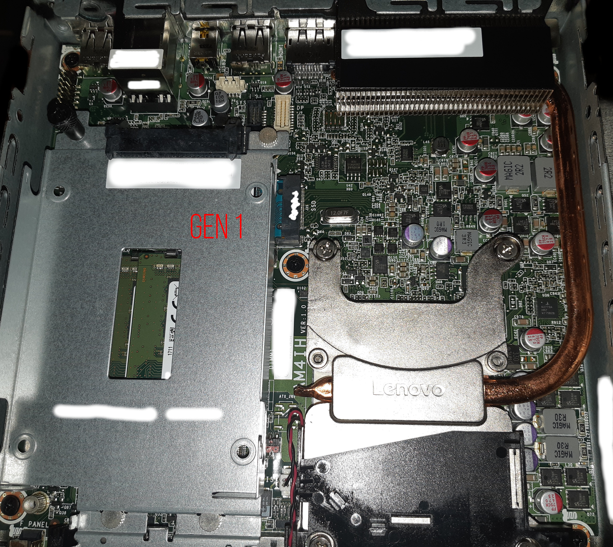
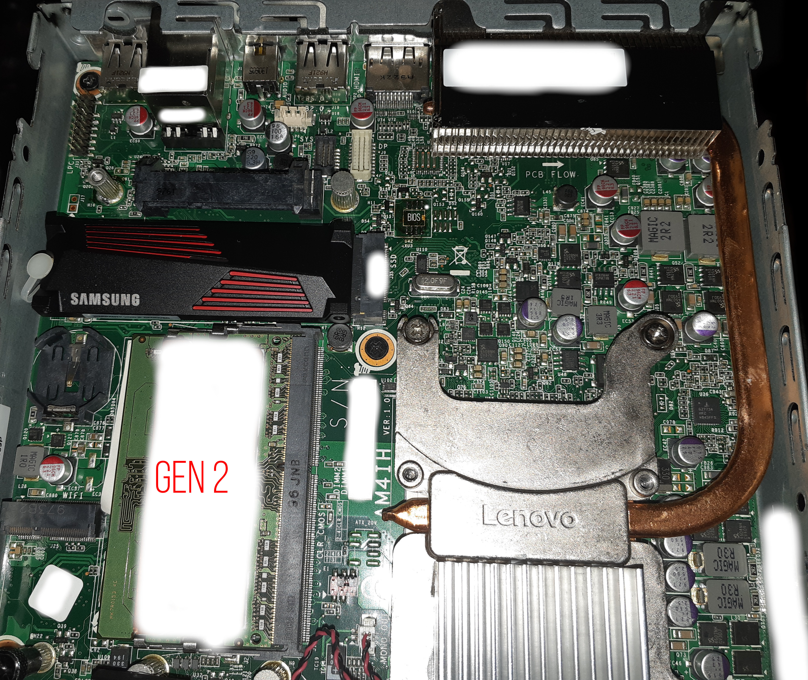
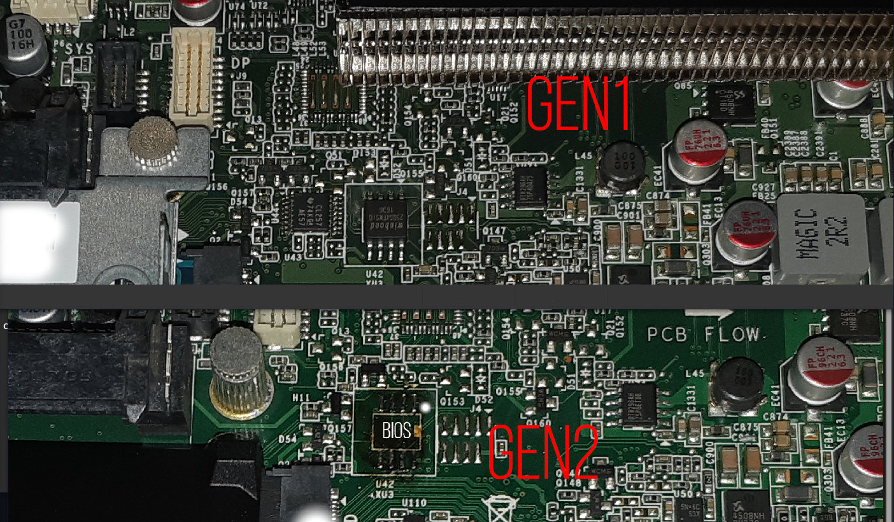
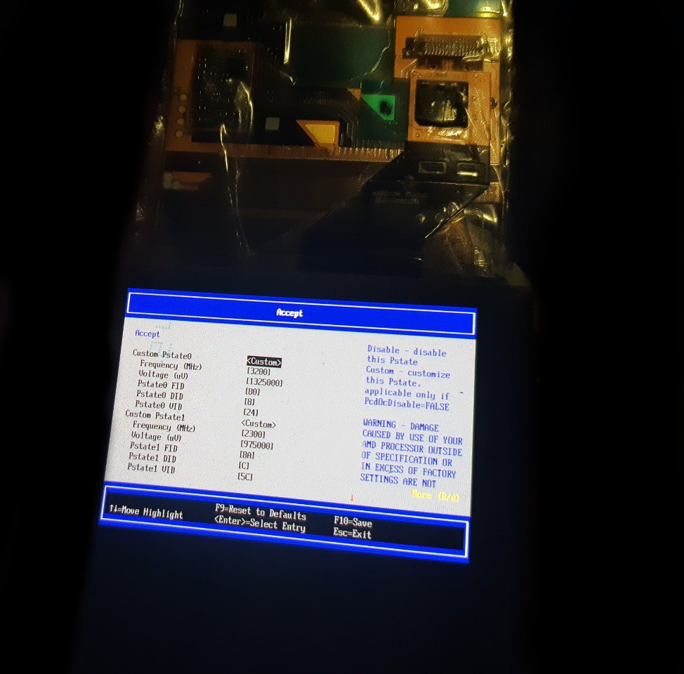
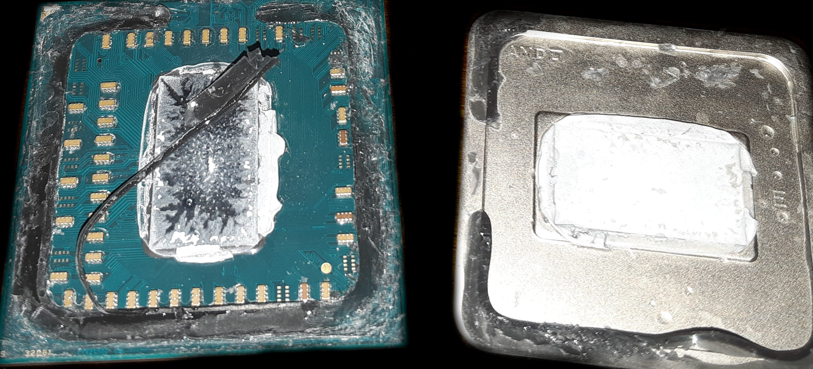
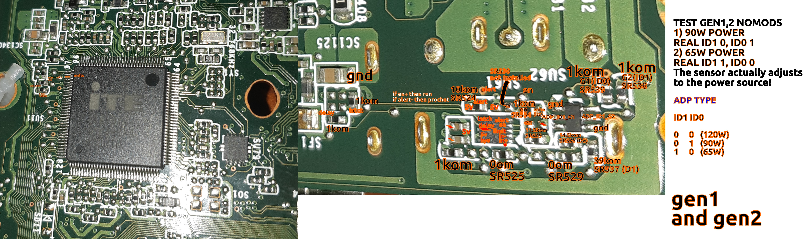
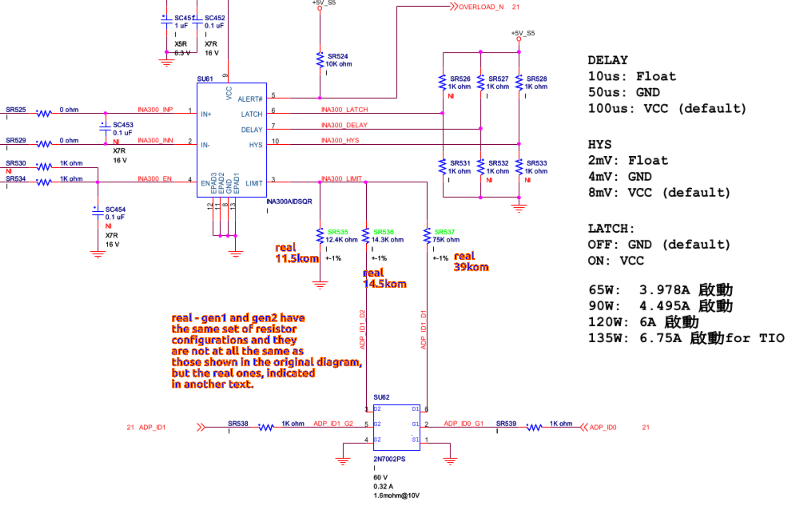
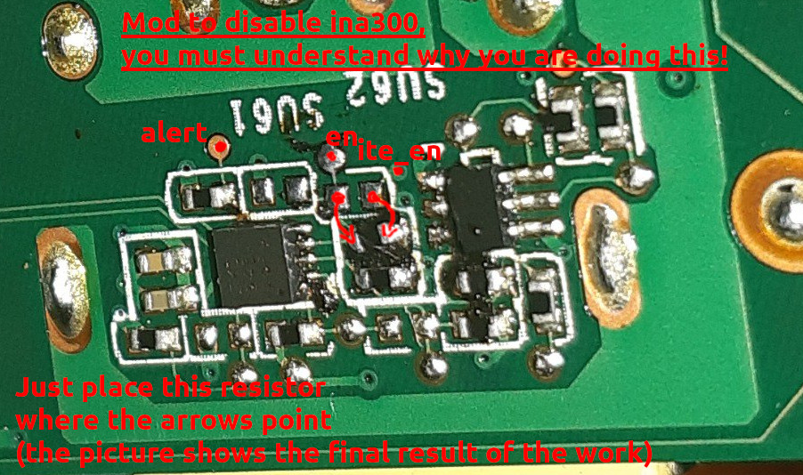

<div id="header" align="center">

<p align="center"></img></p>

  <b>[thinkcentre-m715q]</b>
  
  (Modkit for small PC m715q..)
  </br></br>
<div id="badges">
  <a href="https://github.com/denisandroid">
    
  </a>
</div>
</div>

## Description
This is a collection of my experimental modifications that can be done on the m715q to get the most out of this little computer. Modifications require a certain level of skill and equipment, depending on the type of modification.

## Disclaimer
| :boom: Disclaimer          |
|:---------------------------|
|  :warning:  Lenovo is a registered trademark, I have no relation to Lenovo, I do not give advice on equipment, if you want to know more about this computer, you can find contacts on lenovo.com and ask there. |
|  :warning:  <b>You can do what is described here only at your own risk.</b> Damage to your computer may occur at any stage of these procedures. |
|  :warning: Any information described here is research information. |
|  :warning:  All rights reserved. |

## Specifications

<b></img></b>

### Gen1

<b></img></b>

| name | value |
| ---- | ----- |
| board | m715q GEN 1 |
| maximum cpu | PRO A12-8870E (x4 2.9Ghz (turbo: single core 3.8Ghz)) |
| standard cpu | PRO A10-8770E (x4 2.8Ghz (turbo: single core 3.5Ghz)) |
| mem | DDR4-2400, max: 32Gb (officially) |
| bios | winbond 25q64fwsig (8mb/64mbit, 1.8v) |
| vrm | ISL62773 (0.5V-1.55V) |
| sound | ALC233-CG, internal mono speaker |
| sata | x1 3.0 (6Gbit/s) |
| multicontroller (motherboard) | ITE 8738 (FAN, COMPORT, ...) |
| additional controller (motherboard) | NPCT652L (TPM) |
| usb 2.0 | single GL852G-MNY50 (480mb/s cpu channel common for all usb 2.0 ports for this mini pc) |
| usb 3.0 | x1 (in front near the button), x1 (in front near the red line, ability to charge when the device is turned off), x1 (near the power connector). Despite the presence of three ports, they all use one common bus limited to 10 Gbps/s cpu channel (either one port utilizing 10 Gbps (support for USB 3.1 gen 2, 10 Gbps not tested), or two ports utilizing 5 Gbps, or three ports utilizing 3.3 Gbps). |
| gpio list | ? |
| addition sensors | temperature sensor near vrm |

### Gen2

<b></img></b>

| name | value |
| ---- | ----- |
| board | m715q GEN 2 |
| maximum cpu | Ryzen 5 PRO 2400GE (x4 3.2Ghz (support overclock on all cores: 3.6Ghz/3.8Ghz) (turbo: single core x1 3.8Ghz)) |
| standard cpu | Ryzen 3 PRO 2200GE (x4 3.2Ghz (support overclock on all cores: 3.6Ghz/ 3.8Ghz?) (turbo: single core x1 3.6Ghz)) |
| mem (officially, 2200GE) | DDR4-2933, max: 32Gb 
| mem (unofficially) | DDR4-3200, DDR4-3400, (max: 64Gb (<b>not tested</b>)) |
| bios | MX25U12835F (16mb/128mbit, 1.8v) |
| vrm | ISL62773 (0.5V-1.55V) |
| sound | ALC233-CG, internal mono speaker |
| pcie | nvme (31.504 Gb/s PCIe bandwidth, 8.0 GT/s PCIe x4, cpu channel), wifi (?, x1, cpu channel), lan (?, x1, RT8111EPV, 1Gbit, cpu channel) |
| sata | x1 3.0 (6Gbit/s) |
| multicontroller (motherboard) | ITE 8738 (FAN, COMPORT, ...) |
| additional controller (motherboard) | NPCT652L (TPM) |
| usb 2.0 | single GL852G-MNY50 (480mb/s cpu channel common for all usb 2.0 ports for this mini pc) |
| usb 3.0 | x1 (in front near the button), x1 (in front near the red line, ability to charge when the device is turned off), x1 (near the power connector). Despite the presence of three ports, they all use one common bus limited to 10 Gbps/s cpu channel (either one port utilizing 10 Gbps (support for USB 3.1 gen 2, 10 Gbps not tested), or two ports utilizing 5 Gbps, or three ports utilizing 3.3 Gbps). |
| gpio list | ? |
| tested on |  overclock (cpu, mem, gpu?+), gpu memsize (1Gb, 2Gb, 3Gb, 8Gb, ...), smt shutdown, c6 en/off, pcie (aspm, performance mode) |
| addition sensors | temperature sensor near vrm |

<i>Fun fact:</i> There is a USB 3.0 port underneath the Ethernet port, but the USB 3.0 lines aren't actually connected to anything, and its original functionality remains a mystery. However, upon inspection, traces were found leading to a multi-controller.

<i>Interesting fact:</i> On Gen1, on the back side of the board, there are contacts for soldering the second SATA port (I haven’t tested its functionality), on Gen2 these contacts are no longer there.

## Converting a Gen1 board to a Gen2 board

<b></img></b>

Although the boards are slightly different, a Gen1 board can easily be converted to a Gen2 board, allowing access to the new processors and features.

The GEN1 board has a Winbond 25q64fwsig BIOS chip (see photos for chip location). You should replace this chip with a 16MB BIOS chip, such as the MX25U12835F or W25Q128FWSIG.

BIOS chips are rated for 1.8V only. Do not attempt to solder a 3.3V chip. You will also need a 1.8V module for your programmer to flash the chip (flashing at 3.3V may damage the chip or result in an incomplete flash).

The BIOS chip should be flashed with a stock BIOS or a modified BIOS from the repository (note that these have test serial numbers embedded in them)

## Unlocked BIOS
Please note that there is an unlocked BIOS dump available in the repository, taken from a public source. It can do many things, such as enable overclocking and allocate video memory (up to 10GB, I think).

It can be directly flashed to a GEN2 system. For GEN1 systems, see instructions on converting a GEN1 system to a GEN2 system.

Please note that many settings in this unlocked BIOS are stored only in the BIOS chip. If you incorrectly overclock/undervolt your CPU, you will not be able to boot until you reflash the BIOS chip.

<i>If you don't want to flash a GEN2 system, you can download Smokeless_UMAF to a USB stick from an external source and load TianocoreBios from there with some features unlocked. However, you will only get full functionality from an unlocked BIOS (and note that incorrect settings in Smokeless, as well as settings in the flashed BIOS, can damage the board, in the best case you will have to flash the BIOS chip).</i>

## Overclocking and Undervolting (applies to both 2400GE and 2200GE)

<b></img></b>

<details open> 
  <summary><b># V2.0 (tested on 2400GE)</b></summary>
  
| comment                  | 0 |        1|         2|         3|                 4    |
| -----------------------| --------  | --------| --------   |  --------    | -------- |
| should be displayed      |3800 Mhz | 3600 Mhz| 2300 Mhz   |  1600 Mhz    | 1000 Mhz |
| should be displayed      |1.293750| 1.293750| 393750 (?) |   393750 (?) |  393750  |
| what needs to be entered |98       |       90|       8a   |   80         |       50 |
| what needs to be entered |8        |        8|        C   |   10         |       10 |
| what needs to be entered |29       |       29|       b9   |   b9         |       b9 |

There are no exact recommendations here on how to set the frequencies and what frequencies you need, you can enter only pstate0 and get overclocking or enter all frequencies.

You can also enter the following set of frequencies (tested on 2400GE): 3.6Ghz, 3.5Ghz, 3.2Ghz, 1.0Ghz.

| :memo:        | <b>This section is not complete, I have not yet decided on the voltage, and you should also understand that not every processor will be able to work at a lower voltage with the frequencies specified here.</b>    |
|---------------|:-------------------------------------------|
</details>


<details> 
  <summary><b># V1.0 (tested on 2200GE)</b></summary>
Added lower voltages for higher frequencies. Also added 1.0 GHz and added overclock to 3.6 GHz (you can just leave 3.6 off your list if you don't need it).

| comment                | 0|        1|        2|         3|          4|
| -----------------------| --------| --------| --------|  --------|   --------|
| should be displayed      |3600 Mhz| 3200 Mhz| 2300 Mhz|  1600 Mhz | 1000 Mhz |
| should be displayed      |1.293750| 1.293750 | 97500 v|   87500 v |  77500 v |
| what needs to be entered |90|       80|       8a|  80 |       50 |
| what needs to be entered |8|        8|        C|    10 |       10 |
| what needs to be entered |29|       29|       5C| 6C |       7C|

| :memo:        | <b>This section is not complete, I have not yet decided on the voltage, and you should also understand that not every processor will be able to work at a lower voltage with the frequencies specified here.</b>    |
|---------------|:-------------------------------------------|
</details>

<details> 
  <summary><b># ?, for extreme overclocking (in case of an error, reflash the BIOS)</b></summary>
  
| Voltage | Ghz |
| ------- | --- |
| 1,3 ≤ 1,288 | <b>3.929</b> |
| 1,35 ≤ 1,344 | <b>3.979</b> |
| 1,4 ≤ 1,394 | <b>4.054</b> |
| 1,45 ≤ 1,444 | <b>4.076</b> |
| 1,5 ≤ 1,494 | <b>4.129</b> |

| :exclamation:        | <b>The parameters may be unique to your processor, so the values ​​are approximate.</b>       |
|---------------|:-------------------------------------------|
</details>

## Improve cooling

<details> 
  <summary><b># Processor scalping (tested on 2200GE and 2400GE)</b></summary>
<b></img></b>

Few people know that AMD APUs have thermal paste inside, and quite a thick layer at that, and this thermal paste dries out over time. For effective scalping, it is recommended to soak the processor in a solvent for 10-20 minutes, then cut off the sealant with a razor blade (be extremely careful or skip the scalping step, or better yet, buy a ready-made scalping kit for such processors). It is important not to scratch the printed circuit board, as this can damage the APU. Next, you can apply a thin layer of liquid metal to the processor, for example, with cotton swabs, or try not to use the processor cover at all (not tested and most likely impossible with this cooling system) and seal the processor cover with sealant (if the cover is not glued, there is a risk of metal leakage outside the processor).

It is also recommended to isolate the APU components by coating them with varnish or using special frames.

| :memo:        | Please note that we only applied liquid metal to the processor itself under its heatsink, the heatsink is completely chemically stable, as the processor cover is made of nickel-plated copper.       |
|---------------|:-------------------------------------------|

| :exclamation:        | <i><b>DO NOT</b> try to apply liquid metal between the cooler and the processor cover, even if it is copper (pure copper will absorb liquid metal over time and worsen the cooling), you can easily kill the cooling system.</i>       |
|---------------|:-------------------------------------------|
</details>

## Unlock CPU TDP (only for GEN 2)

<details> 
  <summary><b># ryzenadj</b></summary>
At the moment this problem is not solved at the BIOS level, but is solved at the operating system level (Windows or Linux).

| name | value |
| ------- | --- |
| CPU Family | Raven |
| SMU BIOS Interface Version | 5 |
| Version | v0.16.0 |
| PM Table Version | 1e0004 |

|        Name         |   Value   |     Parameter      |
|---------------------|-----------|--------------------|
| STAPM LIMIT         |    35.000 | stapm-limit        |
| STAPM VALUE         |     8.257 |                    |
| PPT LIMIT FAST      |    76.000 | fast-limit         |
| PPT VALUE FAST      |     8.990 |                    |
| PPT LIMIT SLOW      |    76.000 | slow-limit         |
| PPT VALUE SLOW      |     8.392 |                    |
| StapmTimeConst      |   100.000 | stapm-time         |
| SlowPPTTimeConst    |     5.000 | slow-time          |
| PPT LIMIT APU       |       nan | apu-slow-limit     |
| PPT VALUE APU       |       nan |                    |
| TDC LIMIT VDD       |    65.000 | vrm-current        |
| TDC VALUE VDD       |     2.381 |                    |
| TDC LIMIT SOC       |    50.000 | vrmsoc-current     |
| TDC VALUE SOC       |     4.295 |                    |
| EDC LIMIT VDD       |    95.000 | vrmmax-current     |
| EDC VALUE VDD       |    73.013 |                    |
| EDC LIMIT SOC       |    75.000 | vrmsocmax-current  |
| EDC VALUE SOC       |    18.217 |                    |
| THM LIMIT CORE      |    95.000 | tctl-temp          |
| THM VALUE CORE      |    40.853 |                    |
| STT LIMIT APU       |       nan | apu-skin-temp      |
| STT VALUE APU       |       nan |                    |
| STT LIMIT dGPU      |       nan | dgpu-skin-temp     |
| STT VALUE dGPU      |       nan |                    |
| CCLK Boost SETPOINT |    30.000 | power-saving /     |
| CCLK BUSY VALUE     |     6.150 | max-performance    |

As you can see, the default PPT parameters are very strange, I still haven’t found any specific optimal ones, so I simply recommend raising the TDP to 60 W (<b>but only after a complete modification of the cooling</b>).

```bash
# TDP, 35=>60
ryzenadj --stapm-limit=60000
```

(This code can simply be placed in rc.local, in Windows you can use Ryzen Controller.)

| :memo:        | <b>This section is not complete.</b>       |
|---------------|:-------------------------------------------|
</details>

## Board power
Typically, the first and second generation m715q are equipped with a 65W power supply. To overclock this mini PC, you will obviously need a more powerful power supply, for example, 90 or even 120W. Let me say right away that (with the help of Ryzenadj and other similar solutions, this is solved) this motherboard is software-locked at 65W. In addition, in addition to the software limitation of the processor power, the board has a hardware current sensor based on ina300, which limits the total power of the board and, if exceeded, requests the multicontroller to throttle the processor. Surprisingly, this current sensor is actually configured depending on the power of the power supply (support for 65W, 90W, 120W is declared), this is checked on 65W, 90W power supplies.

<details> 
  <summary><b># Scheme</b></summary>
  <b></img></b>
  <b></img></b>
</details>

<details> 
  <summary><b># 01 ModDisIna</b></summary>
  The entire protection of the ina300 current sensor is based on the fact that the multicontroller sets the maximum consumption level of the board with two outputs (see the "Limitations" branch). When this limit is exceeded, an alert is triggered, which is also sent to the multicontroller. The multicontroller, receiving such a signal, does nothing except send a signal to slow down the processor. The multicontroller also has an output that activates or deactivates this protection; by default, it is always active. In general, this protection is adequate, except that the moment of receiving the signal, the moment of installation, the moment of operation and the moment of throttling - all this happens through the multicontroller, although this should be implemented in hardware. 
  
  There is a theory that initially they wanted to enable and disable this protection programmatically, but, as usual, they did not give access to it. The essence of the modification: to rearrange the 1 kOhm switch-on resistor for ina300, by default this resistor transmits a signal from the multicontroller to the en pin of ina300, by rearranging the resistor to lower landing places you will permanently set the en pin to ground, thereby disabling the ina300 sensor, the `alert` is always pulled up to the plus and will not ask to throttle the processor when the sensor is disabled!
  
  # <b>You must understand why you need this, do it only at your own risk!</b>
  
  <b></img></b>

  In my case, after modification, I got a stable working device both on gen1 and gen2 from a 90W power supply with a maximum processor consumption of 42W, previously on gen2 there were strange, random long dips in operation without load.
</details>

## Known issues

<details open> 
  <summary><b>• Poor performance after reboot (gen2, linux)</b></summary>
It has been observed that if the system is rebooted (e.g. with reboot command), the Linux tsc clock source is always lost, which causes the whole system performance to drop to very low levels (CPU, RAM). This issue is not fixed by BIOS updates and seems to have been around for a long time. If you set tsc=unstable then the performance on reboot is always constant but also slightly lower than on first boot, which suggests that there really is some problem with tsc.

```dmesg
[    8.502316] clocksource: timekeeping watchdog on CPU0: Marking clocksource 'tsc' as unstable because the skew is too large:
[    8.502335] clocksource:                       'hpet' wd_nsec: 495412266 wd_now: 74b2d4c wd_last: 6def0b2 mask: ffffffff
[    8.502343] clocksource:                       'tsc' cs_nsec: 496288695 cs_now: 1a21e4cda2 cs_last: 19b1b24352 mask: ffffffffffffffff
[    8.502349] clocksource:                       Clocksource 'tsc' skewed 876429 ns (0 ms) over watchdog 'hpet' interval of 495412266 ns (495 ms)
[    8.502355] clocksource:                       'tsc' is current clocksource.
[    8.502371] tsc: Marking TSC unstable due to clocksource watchdog
[    8.502392] TSC found unstable after boot, most likely due to broken BIOS. Use 'tsc=unstable'.
[    8.502394] sched_clock: Marking unstable (8511381561, -8990127)<-(8520197471, -17805900)
[    8.502614] clocksource: Checking clocksource tsc synchronization from CPU 4 to CPUs 0,5.
[    8.502630] clocksource: Override clocksource tsc is unstable and not HRT compatible - cannot switch while in HRT/NOHZ mode
[    8.502664] clocksource: Switched to clocksource hpet
```
| :memo:        | <b>There is currently no complete solution to this problem, you can simply turn on/off the device instead of rebooting.</b>       |
|---------------|:-------------------------------------------|
</details>

<details> 
  <summary><b># `amd_pstate` not working (gen2, linux)</b></summary>
While this is not a specific CPU frequency and voltage management issue on this device, since `acpi-cpufreq` works fine and well, it is impossible not to mention it.

```dmesg
[    6.884017] amd_pstate_ut: amd_pstate_ut_acpi_cpc_valid the _CPC object is not present in SBIOS!
[    6.884022] amd_pstate_ut: 1    amd_pstate_ut_acpi_cpc_valid	 fail: -22!
[    6.884025] amd_pstate_ut: 2    amd_pstate_ut_check_enabled	 success!
[    6.884029] amd_pstate_ut: 3    amd_pstate_ut_check_perf	 success!
[    6.884032] amd_pstate_ut: 4    amd_pstate_ut_check_freq	 success!
[    6.884037] amd_pstate_ut: 5    amd_pstate_ut_check_driver	 success!
```

The official solution to this issue is to upgrade to Ryzen 3 or higher, but there is currently no solution to upgrade to a more powerful processor.

| :memo:        | <b>The solution has not yet been found.</b>       |
|---------------|:-------------------------------------------|
</details>

<details> 
  <summary><b># The integrated video card switches off from time to time, which is especially noticeable on `linux zen` kernels  (gen2, 2400GE, linux)</b></summary>
Your video card may sometimes turn off and you won't even know why. In dmesg logs you will only see that your video card turned off and on, and some games may show various strange effects. This problem is relevant on modern Linux (2025) and repeats itself over and over again without any symptoms (most likely at times when your gpu frequency increases).

Solution, you need to add this to cmdline:
```
amdgpu.gttsize=8192 amdgpu.lockup_timeout=1000 amdgpu.gpu_recovery=1 amdgpu.noretry=0 amdgpu.ppfeaturemask=0xfffd3fff amdgpu.deep_color=1 systemd.unified_cgroup_hierarchy=true
```

And add this to the file `/etc/environment`
```
AMD_DEBUG=nodcc
```
</details>

<details> 
  <summary><b># The video card only works at low frequencies or only at high frequencies (gen2, 2400ge, linux)</b></summary>
This problem is observed in the latest version of Archlinux, and the reason is not entirely clear. By default, the frequency of the video card should be adjusted depending on the load on the video card, but for some unknown reason (in my case) it is low.

```
echo "high" | tee  /sys/class/drm/card1/device/power_dpm_force_performance_level
echo "performance" | tee  /sys/class/drm/card1/device/power_dpm_state
echo "auto" | tee  /sys/class/drm/card1/device/power_dpm_force_performance_level
echo "balanced" | tee  /sys/class/drm/card1/device/power_dpm_state
```

If you add this meaningless code (transition from auto to hight, from high to balanced) to rc.local, the problem is solved.

</details>

<details> 
  <summary><b># I try to change video memory size to 1/2/8/.. GB but it doesn't happen (gen2, 2400ge, linux)</b></summary>
Turn off the device completely by disconnecting it from the power source, insert the power source and turn it on, then your video memory capacity will change.
</details>
