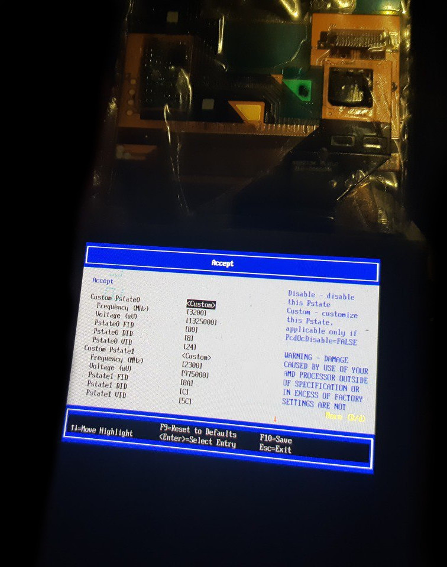

<div id="header" align="center">

<p align="center"></img></p>

  <b>[thinkcentre-m715q]</b>
  
  (Modkit for small PC m715q..)
  </br></br>
<div id="badges">
  <a href="https://github.com/denisandroid">
    
  </a>
</div>
</div>

## Description
This is a collection of mods that can be performed on the m715q to get the most out of these little computers. Mods require some level of skill and equipment, depending on which mod is performed.

## Disclaimer
| :boom: Disclaimer          |
|:---------------------------|
|  :warning:  Lenovo is a registered trademark, I have no relation to Lenovo, I do not give advice on equipment, if you want to know more about this computer, you can find contacts on lenovo.com and ask there. |
|  :warning:  <b>You can do what is described here only at your own risk.</b> Damage to your computer may occur at any stage of these procedures. |
|  :warning:  All rights reserved. |

## Specifications

<b></img></b>

### Gen1

<b></img></b>

| name | value |
| ---- | ----- |
| board | m715q GEN 1 |
| cpu_0 | AMD PRO A12-8870E (x4 2.9 (turbo: one x1 3.8Ghz)) |
| cpu_1 | AMD PRO A10-8770E (x4 2.8 (turbo: one x1 3.5Ghz)) |
| mem | DDR4-2400, max: 32Gb (officially) |
| bios | Winbond 25q64fwsig (8mb) |

### Gen2

<b></img></b>

| name | value |
| ---- | ----- |
| board | m715q GEN 2 |
| cpu0 (or cpu1) | AMD Ryzen 5 PRO 2400GE (x4x2 3.2Ghz (overclock: 3.6Ghz/3.8Ghz) (turbo: one x1 3.8Ghz)) |
| cpu1 (or cpu0) | AMD Ryzen 3 PRO 2200GE (x4 3.2Ghz (overclock: 3.6Ghz/3.8Ghz) (turbo: one x1 3.6Ghz)) |
| mem (officially) | DDR4-2933, max: 32Gb 
| mem (unofficially) | DDR4-3200, (max: 64Gb (<b>not tested</b>)) |
| bios | MX25U12835F (16mb) |

## Converting a Gen1 board to a Gen2 board

<b></img></b>

Although the boards are slightly different, a Gen1 board can easily be converted to a Gen2 board, allowing access to the new processors and features.

The GEN1 board has a Winbond 25q64fwsig BIOS chip (see photos for chip location). You should replace this chip with a 16MB BIOS chip, such as the MX25U12835F or W25Q128FWSIG.

BIOS chips are rated for 1.8V only. Do not attempt to solder a 3.3V chip. You will also need a 1.8V module for your programmer to flash the chip (flashing at 3.3V may damage the chip or result in an incomplete flash).

The BIOS chip should be flashed with a stock BIOS or a modified BIOS from the repository (note that these have test serial numbers embedded in them)

## Unlocked BIOS
Please note that there is an unlocked BIOS dump available in the repository, taken from a public source. It can do many things, such as enable overclocking and allocate video memory (up to 10GB, I think).

It can be directly flashed to a GEN2 system. For GEN1 systems, see instructions on converting a GEN1 system to a GEN2 system.

Please note that many settings in this unlocked BIOS are stored only in the BIOS chip. If you incorrectly overclock/undervolt your CPU, you will not be able to boot until you reflash the BIOS chip.

<i>If you don't want to flash a GEN2 system, you can download Smokeless_UMAF to a USB stick from an external source and load TianocoreBios from there with some features unlocked. However, you will only get full functionality from an unlocked BIOS (and note that incorrect settings in Smokeless, as well as settings in the flashed BIOS, can damage the board, in the best case you will have to flash the BIOS chip).</i>

## Overclocking and Undervolting (applies to both 2400GE and 2200GE)

<b></img></b>

Please note that this list is not complete (lower frequencies can be undervolted even more).
Added lower voltages for higher frequencies. Also added 1.0 GHz and added overclock to 3.6 GHz (you can just leave 3.6 off your list if you don't need it).

| comment                | 0|        1|        2|         3|          4|
| -----------------------| --------| --------| --------|  --------|   --------|
| should be displayed      |3600 Mhz| 3200 Mhz| 2300 Mhz|  1600 Mhz | 1000 Mhz |
| should be displayed      |1.293750| 1.293750 | 97500 v|   87500 v |  77500 v |
| what needs to be entered |90|       80|       8a (138)|  80 |       50 (80) |
| what needs to be entered |8|        8|        C (12)|    10 |       10 (16) |
| what needs to be entered |29|       29|       5C (92) v| 6C |       7C (124) v |

<b><i>What is in brackets and the volt sign does not need to be entered, it was only useful when composing these numbers.</i></b>

<i>Please note that overclocking does not affect turbo mode.</i>

| :memo:        | <b>This section is not complete, I have not yet finally decided on the voltage. For 3.8 on 2400 we write 3.8Ghz 98 8 28.</b>    |
|---------------|:-------------------------------------------|

### For extreme overclocking (in case of an error, reflash the BIOS)

| Voltage | Ghz |
| ------- | --- |
| 1,3 ≤ 1,288 | <b>3.929</b> |
| 1,35 ≤ 1,344 | <b>3.979</b> |
| 1,4 ≤ 1,394 | <b>4.054</b> |
| 1,45 ≤ 1,444 | <b>4.076</b> |
| 1,5 ≤ 1,494 | <b>4.129</b> |


| :exclamation:        | <b>The parameters may be unique to your processor, so the values ​​are approximate.</b>       |
|---------------|:-------------------------------------------|

## Processor scalping (tested on 2200GE and 2400GE)

<b></img></b>

Few people know that AMD APUs have thermal paste inside, and quite a thick layer at that, and this thermal paste dries out over time. For effective scalping, it is recommended to soak the processor in a solvent for 10-20 minutes, then cut off the sealant with a razor blade (be extremely careful or skip the scalping step, or better yet, buy a ready-made scalping kit for such processors). It is important not to scratch the printed circuit board, as this can damage the APU. Next, you can apply a thin layer of liquid metal to the processor, for example, with cotton swabs, or try not to use the processor cover at all (not tested and most likely impossible with this cooling system) and seal the processor cover with sealant (if the cover is not glued, there is a risk of metal leakage outside the processor).

It is also recommended to isolate the APU components by coating them with varnish or using special frames.

<i>Please note that we only applied liquid metal to the processor itself under its heatsink, the heatsink is completely chemically stable, as the processor cover is made of nickel-plated copper.</i>


| :exclamation:        | <i><b>DO NOT</b> try to apply liquid metal between the cooler and the processor cover, even if it is copper (pure copper will absorb liquid metal over time and worsen the cooling), you can easily kill the cooling system.</i>       |
|---------------|:-------------------------------------------|

## Unlock CPU TDP

At the moment this problem is not solved at the BIOS level, but is solved at the operating system level (Windows or Linux).

| name | value |
| ------- | --- |
| CPU Family | Raven |
| SMU BIOS Interface Version | 5 |
| Version | v0.16.0 |
| PM Table Version | 1e0004 |

|        Name         |   Value   |     Parameter      |
|---------------------|-----------|--------------------|
| STAPM LIMIT         |    35.000 | stapm-limit        |
| STAPM VALUE         |     8.257 |                    |
| PPT LIMIT FAST      |    76.000 | fast-limit         |
| PPT VALUE FAST      |     8.990 |                    |
| PPT LIMIT SLOW      |    76.000 | slow-limit         |
| PPT VALUE SLOW      |     8.392 |                    |
| StapmTimeConst      |   100.000 | stapm-time         |
| SlowPPTTimeConst    |     5.000 | slow-time          |
| PPT LIMIT APU       |       nan | apu-slow-limit     |
| PPT VALUE APU       |       nan |                    |
| TDC LIMIT VDD       |    65.000 | vrm-current        |
| TDC VALUE VDD       |     2.381 |                    |
| TDC LIMIT SOC       |    50.000 | vrmsoc-current     |
| TDC VALUE SOC       |     4.295 |                    |
| EDC LIMIT VDD       |    95.000 | vrmmax-current     |
| EDC VALUE VDD       |    73.013 |                    |
| EDC LIMIT SOC       |    75.000 | vrmsocmax-current  |
| EDC VALUE SOC       |    18.217 |                    |
| THM LIMIT CORE      |    95.000 | tctl-temp          |
| THM VALUE CORE      |    40.853 |                    |
| STT LIMIT APU       |       nan | apu-skin-temp      |
| STT VALUE APU       |       nan |                    |
| STT LIMIT dGPU      |       nan | dgpu-skin-temp     |
| STT VALUE dGPU      |       nan |                    |
| CCLK Boost SETPOINT |    30.000 | power-saving /     |
| CCLK BUSY VALUE     |     6.150 | max-performance    |

As you can see, the default PPT parameters are very strange, I still haven’t found any specific optimal ones, so I simply recommend raising the TDP to 60 W (<b>but only after a complete modification of the cooling</b>).

```bash
# TDP, 35=>60
ryzenadj --stapm-limit=60000
```

(This code can simply be placed in rc.local, in Windows you can use Ryzen Controller.)

| :memo:        | <b>This section is not complete.</b>       |
|---------------|:-------------------------------------------|


## Known issues

#### • Poor performance after reboot (gen2, linux)

It has been observed that if the system is rebooted (e.g. with reboot command), the Linux tsc clock source is always lost, which causes the whole system performance to drop to very low levels (CPU, RAM). This issue is not fixed by BIOS updates and seems to have been around for a long time. If you set tsc=unstable then the performance on reboot is always constant but also slightly lower than on first boot, which suggests that there really is some problem with tsc.

```dmesg
[    8.502316] clocksource: timekeeping watchdog on CPU0: Marking clocksource 'tsc' as unstable because the skew is too large:
[    8.502335] clocksource:                       'hpet' wd_nsec: 495412266 wd_now: 74b2d4c wd_last: 6def0b2 mask: ffffffff
[    8.502343] clocksource:                       'tsc' cs_nsec: 496288695 cs_now: 1a21e4cda2 cs_last: 19b1b24352 mask: ffffffffffffffff
[    8.502349] clocksource:                       Clocksource 'tsc' skewed 876429 ns (0 ms) over watchdog 'hpet' interval of 495412266 ns (495 ms)
[    8.502355] clocksource:                       'tsc' is current clocksource.
[    8.502371] tsc: Marking TSC unstable due to clocksource watchdog
[    8.502392] TSC found unstable after boot, most likely due to broken BIOS. Use 'tsc=unstable'.
[    8.502394] sched_clock: Marking unstable (8511381561, -8990127)<-(8520197471, -17805900)
[    8.502614] clocksource: Checking clocksource tsc synchronization from CPU 4 to CPUs 0,5.
[    8.502630] clocksource: Override clocksource tsc is unstable and not HRT compatible - cannot switch while in HRT/NOHZ mode
[    8.502664] clocksource: Switched to clocksource hpet
```

